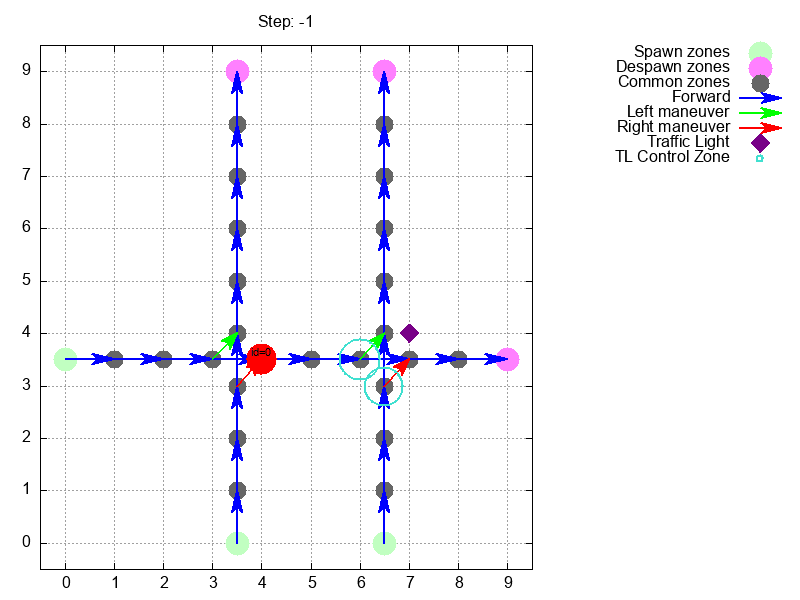
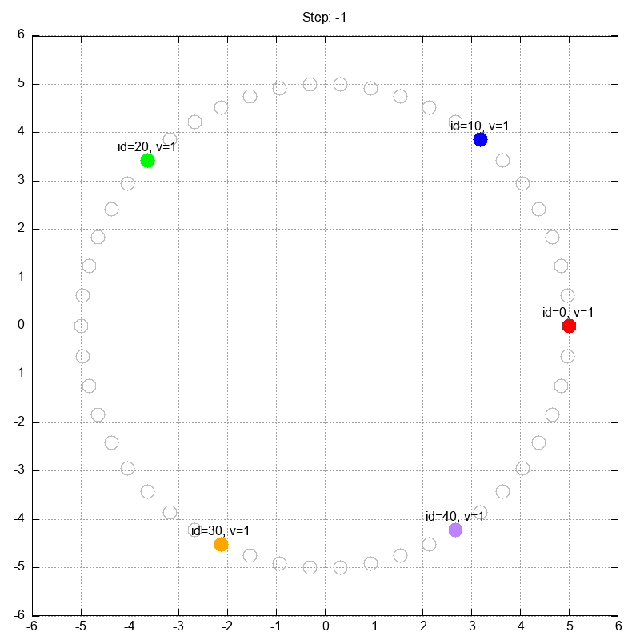
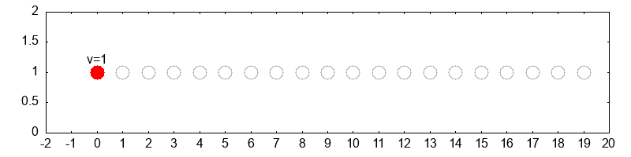
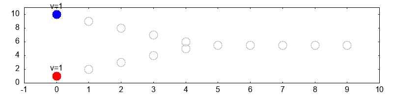

# micro_traffic_sim_core - core for traffic simulation via cellular automata

API may change since project is in early stages.

Table of contents
- [Introduction](#introduction)
- [Project layout](#project-layout)
- [Quick start (Rust)](#quick-start-rust)
  - [Run example: NaSch one-lane](#run-example-nasch-one-lane)
  - [Build release binary for example](#build-release-binary-for-example)
  - [Benchmark with hyperfine](#benchmark-with-hyperfine)
- [Complete workflow guide](#complete-workflow-guide)
  - [Add crate to your project](#add-crate-to-your-project)
  - [Basic workflow overview](#basic-workflow-overview)
  - [Verbose logging](#verbose-logging)
  - [Creating the grid](#creating-the-grid)
  - [Optionally add conflict zones](#optionally-add-conflict-zones)
  - [Creating vehicles statically](#creating-vehicles-statically)
  - [Creating vehicles dynamically via trips](#creating-vehicles-dynamically-via-trips)
  - [Optionally add traffic lights](#optionally-add-traffic-lights)
  - [Setting up the simulation session](#setting-up-the-simulation-session)
  - [Running the simulation](#running-the-simulation)
  - [Extracting results](#extracting-results)
  - [Analyzing results](#analyzing-results)
  - [Visualization with gnuplot](#visualization-with-gnuplot)
- [Key modules / API pointers](#key-modules--api-pointers)

## Introduction

`micro_traffic_sim_core` is a Rust core library for microscopic traffic simulation (NaSch-like cellular automata and agent-based behaviours). The codebase contains utilities for grids, agents, intentions, conflicts, pathfinding, and session simulation.

Simple coordinated zone | Simple ring-like grid
:-------------------------:|:-------------------------:
  |  

NaSch one-lane road | NaSch two-lane road
:-------------------------:|:-------------------------:
  |  

Merging roads | 
:-------------------------:| 


__Disclaimer__: Repository documentation will have a lot of technical details in text form since this is a computational core which will not be used by end-users directly, but rather integrated into service of some sort (gRPC/REST).

## Project layout

Top-level modules are exported from [`src/lib.rs`](src/lib.rs).

Examples live under the `examples/` directory. Notable examples:
- [`examples/nasch-one-lane/main.rs`](examples/nasch-one-lane/main.rs) - minimal one-lane NaSch example
- [`examples/nasch-two-lanes/main.rs`](examples/nasch-two-lanes/main.rs) - minimal two-lane NaSch example
- [`examples/nasch-lanes-merge/main.rs`](examples/nasch-lanes-merge/main.rs) - merging two lanes into one
- [`examples/nasch-roads-merge/main.rs`](examples/nasch-roads-merge/main.rs) - merging two roads into one
- [`examples/ring/main.rs`](examples/ring/main.rs) - ring-like road network
- [`examples/tutorial/main.rs`](examples/tutorial/main.rs) - complete tutorial with grid creation, trips, traffic lights, and CSV-like output

Benchmarks:
- [`benches/shortest_path_benchmark.rs`](benches/shortest_path_benchmark.rs)

## Quick start (Rust)

Prerequisites
- Rust toolchain (`rustup` + `cargo`)
- Optionally: `hyperfine` for repeated benchmarking

### Run example: NaSch one-lane

Build and run an example (prints CSV-like step output).

* Run directly (debug):
    ```sh
    cargo run --example nasch-one-lane
    ```

* Capture output to a file (useful for plotting):
    ```sh
    cargo run --example nasch-one-lane > examples/nasch-one-lane/output.txt
    ```

### Build release binary for the example:
```sh
cargo build --release --example nasch-one-lane
./target/release/examples/nasch-one-lane
```

### Benchmark with hyperfine
```sh
hyperfine -i --shell=none --output=pipe --runs 30 --warmup 2 -n "Rust NaSch version" "./target/release/examples/nasch-one-lane"
```

## Complete workflow guide

### Add crate to your project
Add to `Cargo.toml`:
```toml
[dependencies]
micro_traffic_sim_core = "0.1.1"
```

### Basic workflow overview

Every simulation follows this pattern:
1. **Create Grid** - Build road network with cells
2. **Create Vehicles/Trips** - Define agents and their routes  
3. **Setup Session** - Initialize simulation runtime
4. **Run Simulation** - Execute time steps
5. **Extract Results** - Collect vehicle states and positions
6. **Visualize** - E.g. plot results with gnuplot

**The full example for grid basics is in [`examples/grid-basics`](examples/grid-basics).**

**The full example for whole simulation is in [`examples/tutorial`](examples/tutorial).**

### Verbose logging
Before we continue it is worth to mention that the simulation session supports verbose logging at different levels. This can be very useful for debugging and understanding the simulation flow.

Currently supported levels are:
- `VerboseLevel::None` - No logging
- `VerboseLevel::Main` - Main simulation pipeline steps.
- `VerboseLevel::Additional` - More detailed logging: loops of main steps.
- `VerboseLevel::Detailed` - Additional detailed logging: internal computations.

How to set verbose level:
```rust
use micro_traffic_sim_core::verbose::VerboseLevel;
/* ... */
fn main () {
  /* ... */
  let mut session = Session::new(grids_storage, None); // Internal session's logger will be set to None automatically
  session.set_verbose_level(VerboseLevel::Main); // Set desired level here
  /* ... */
}
```

### Creating the grid

The grid represents your road network as a collection of connected cells. Each cell is a discrete unit where vehicles can be positioned.

```rust
/* ... */
use micro_traffic_sim_core::geom::new_point;
use micro_traffic_sim_core::grid::{cell::Cell, road_network::GridRoads, zones::ZoneType};
/* ... */
fn main() {
  /* ... */
  let mut grid = GridRoads::new();
  let mut cell_id = 1;
  let cell = Cell::new(cell_id)
    .with_point(new_point(1.0, 1.0, None))
    .with_zone_type(ZoneType::Birth)
    .with_speed_limit(3)
    .with_forward_node(2)
    .with_left_node(7)
    .with_right_node(-1)
    .with_meso_link_id(100500)
    .build();
  grid.add_cell(cell);
  cell_id += 1;
  /* ... */
}
/* ... */
```

**Cell attributes explained:**

- **`id`**: Unique identifier for referencing this cell from other cells (`CellID` type, which is `i64`) or by vehicles states in the simulation.
- **`point`**: Physical coordinates in your coordinate system (`PointType` - can be geographic with SRID)
- **`type_zone`**: Defines the cell's role in traffic flow (`ZoneType` enum). Basic types are:
  - `Birth` - Vehicles spawn here (start of road)
  - `Death` - Vehicles despawn here (end of road)  
  - `Common` - Regular road segment

  All types are described in [`zones.rs`](src/grid/zones.rs).
- **`speed_limit`**: Maximum velocity in cellular automata units (integer, cells per simulation step)
- **`left_cell`**: Cell ID for left lane changes (`CellID`, use `-1` if no connection available)
- **`forward_cell`**: Cell ID for forward movement (`CellID`, use `-1` if no connection available)
- **`right_cell`**: Cell ID for right lane changes (`CellID`, use `-1` if no connection available)
- **`meso_link_id`**: Identifier linking the cell to a mesoscopic graph (integer, `-1` if not applicable). Could be used for multi-resolution simulations or aggregated traffic flow analysis.

**Connection rules:**
- Use `-1` to indicate "no connection available" for any cell reference
- Left/right connections enable lane changing behavior  
- Each cell can have only one forward connection, left connection, and right connection.
- Same time each cell can have multiple incoming connections from other cells, but it is recommended two have only one left/right incoming connection to avoid ambiguity in lane changing (number forward connections is unlimited in that context).

### Optionally add conflict zones

Conflict zones handle situations where vehicle paths intersect, defining priority rules for resolution.

```rust
use micro_traffic_sim_core::conflict_zones::{ConflictWinnerType, ConflictEdge, ConflictZone};
use std::collections::HashMap;

fn main() {
    // ... grid setup code ...
    // Create conflict zones storage
    let mut conflict_zones = HashMap::new();
    // Example: define a conflict where horizontal and vertical traffic intersect
    let conflict_zone = ConflictZone::new(
            1, // Conflict zone ID
            ConflictEdge {
                source: 3,  // Horizontal approach (cell 3)
                target: 4,  // Horizontal exit (cell 4)
            },
            ConflictEdge {
                source: 13, // Vertical approach (cell 13)
                target: 14, // Vertical exit (cell 14)
            },
        )
        // V1 has priority over H
        .with_winner_type(ConflictWinnerType::Second)
        .build();
    conflict_zones.insert(conflict_zone.get_id(), conflict_zone);
    // ... rest of simulation setup ...
}
```

### Optionally add traffic lights

Traffic lights control vehicle flow through signal groups that manage different approaches.

```rust
use micro_traffic_sim_core::traffic_lights::lights::TrafficLight;
use micro_traffic_sim_core::traffic_lights::groups::TrafficLightGroup;
use micro_traffic_sim_core::traffic_lights::signals::SignalType;
use micro_traffic_sim_core::geom::new_point;
use std::collections::HashMap;

fn main() {
    // ... grid setup code ...
    let mut tls = HashMap::new();
    // Create signal groups for horizontal and vertical approaches
    let group_h = TrafficLightGroup::new(100) // Horizontal group ID
        .with_cells_ids(vec![6])              // Control cell 6
        .with_label("Group block H".to_string())
        .with_signal(vec![SignalType::Green, SignalType::Red]) // Start green
        .build();
    let group_v2 = TrafficLightGroup::new(200) // Vertical group ID  
        .with_cells_ids(vec![23])              // Control cell 23
        .with_label("Group block V2".to_string())
        .with_signal(vec![SignalType::Red, SignalType::Green]) // Start red (opposite)
        .build();
    // Create traffic light with timing
    let tl = TrafficLight::new(1)
        .with_coordinates(new_point(7.0, 4.0, None)) // Physical location
        .with_phases_times(vec![5, 5])                // 5 steps green, 5 steps red
        .with_groups(vec![group_h, group_v2])
        .build();
    tls.insert(tl.get_id(), tl);
    // ... rest of simulation setup ...
}
```

### Creating vehicles statically

Create individual vehicles with specific starting positions and routes.

```rust
use micro_traffic_sim_core::agents::Vehicle;

fn main() {
  // ... grid setup code ...
  // Create a single vehicle
  let vehicle = Vehicle::new(0)           // Vehicle ID
    .with_speed(1)                      // Current speed
    .with_speed_limit(1)                // Maximum speed
    .with_cell(4)                       // Starting cell
    .with_destination(9)                // Goal cell
    .build();
  // Pass owned vehicles to the session
  let vehicles: Vec<Vehicle> = vec![vehicle];
  // ... rest of simulation setup ...
}
```

### Creating vehicles dynamically via trips

Create trip generators that spawn vehicles probabilistically during simulation.

```rust
use micro_traffic_sim_core::trips::trip::{Trip, TripType};
use micro_traffic_sim_core::agents_types::AgentType;
use micro_traffic_sim_core::behaviour::BehaviourType;

fn main() {
    // ... grid setup code ...
    
    // Create trips for different roads
    let trips_h = Trip::new(1, 9, TripType::Random)  // From cell 1 to cell 9
        .with_allowed_agent_type(AgentType::Car)
        .with_allowed_behaviour_type(BehaviourType::Cooperative)
        .with_probability(0.1)                        // 10% chance per step
        .build();
        
    let trips_v1 = Trip::new(10, 19, TripType::Random) // Vertical road 1
        .with_allowed_agent_type(AgentType::Car)
        .with_allowed_behaviour_type(BehaviourType::Cooperative)
        .with_probability(0.1)
        .build();
        
    let trips_v2 = Trip::new(20, 29, TripType::Random) // Vertical road 2
        .with_allowed_agent_type(AgentType::Car)
        .with_allowed_behaviour_type(BehaviourType::Cooperative)
        .with_probability(0.1)
        .build();
        
    let trips: Vec<Trip> = vec![trips_h, trips_v1, trips_v2];
    // ... rest of simulation setup ...
}
```

### Setting up the simulation session

When the grid, vehicles, trips, and traffic lights are ready, initialize the simulation session.
```rust
use micro_traffic_sim_core::grid::road_network::GridRoads;
use micro_traffic_sim_core::agents::Vehicle;
use micro_traffic_sim_core::trips::trip::Trip;
use micro_traffic_sim_core::traffic_lights::lights::{TrafficLight, TrafficLightID};
use micro_traffic_sim_core::simulation::session::Session;
use micro_traffic_sim_core::simulation::grids_storage::GridsStorage;
use micro_traffic_sim_core::verbose::VerboseLevel;
use std::collections::HashMap;

fn main () {
  let mut grid = GridRoads::new();
  // Populate grid with cells
  // ...
  let vehicles: Vec<Vehicle> = vec![/* ... vehicles ... */];
  // Prepare vehicles or use generator
  // ...
  let trips: Vec<Trip> = vec![/* ... trips ... */];
  // Prepare trips
  // ...
  let tls: HashMap<TrafficLightID, TrafficLight> = HashMap::new();
  // Prepare traffic lights
  // ...
  let grids_storage = GridsStorage::new()
    .with_vehicles_net(grid)
    .with_tls(tls)
    .build();
  let mut session = Session::new(grids_storage, None);
  session.set_verbose_level(VerboseLevel::Main);
  session.add_vehicles(vehicles);
  for trip in trips.iter() {
    session.add_trip(trip.clone());
  }
}
```

### Running the simulation and collecting the data

Run the simulation for a defined number of steps, collecting vehicle states at each step.
```rust
let steps = 10;
for step in 0..steps {
  match session.step() {
    Ok(automata_state) => {
      for v in automata_state.vehicles {
        println!(
          "{};{};{};{};{:.5};{}",
          step,
          v.id,
          v.vehicle_type,
          v.last_speed,
          v.last_angle,
          v.last_cell,
        );
      }
      for tl in automata_state.tls {
        for group in tl.1 {
          let group_id = group.group_id;
          let signal = group.last_signal;
          println!(
            "tl_step;{};{};{};{:.5};{:.5};{}",
            step,
            tl.0,
            group_id,
            group.last_position.x,
            group.last_position.y,
            signal
          );
        }
      }
    }
    Err(e) => {
      eprintln!("Error during simulation step {}: {:?}", step, e);
    }
  };
}
```

### Analyzing results

You can analyze the output data using various tools.

In the basic tutorial [`examples/tutorial`](examples/tutorial) states are aggregated in CSV-like format (with semicolon delimiter) and then visualized with `gnuplot`(http://www.gnuplot.info/).


In the future, I plan to add example with visualization in the browser using gRPC/WebSockets for integration with server-side.

## Key modules / API pointers

- Library entry: [`src/lib.rs`](src/lib.rs)
- Geometry and spatial utilities:
  - Point - [`src/geom/point.rs`](src/geom/point.rs)
  - Utilities - [`src/geom/spatial.rs`](src/geom/spatial.rs)
- Grid (road network graph):
  - Cell unit - [`src/grid/cell.rs`](src/grid/cell.rs)
  - Road network - [`src/grid/road_network.rs`](src/grid/road_network.rs)
- Pathfinding:
  - A* star for grid-based road network graph - [`src/shortest_path/router.rs`](src/shortest_path/router.rs)
- Traffic lights and signals:
  - Signals - [`src/traffic_lights/signals.rs`](src/traffic_lights/signals.rs)
  - Signal groups (in context of single junction) - [`src/traffic_lights/groups.rs`](src/traffic_lights/groups.rs)
  - Traffic light (as single junction) - [`src/traffic_lights/lights.rs`](src/traffic_lights/lights.rs)
- Agents and related functionality:
  - Agents' behaviour types - [`src/agents/behaviour.rs`](src/agents/behaviour.rs)
  - Vehicle agents - [`src/agents/vehicle.rs`](src/agents/vehicle.rs)
  - Vehicles storage wrapper - [`src/agents/vehicles_storage.rs`](src/agents/vehicles_storage.rs)
- Trips
  - Trips generation - [`src/trips/trip.rs`](src/trips/trip.rs)
- Intentions:
    - Main utilities - [`src/intentions/intention.rs`](src/intentions/intention.rs)
    - Intentions storage - [`src/intentions/intentions_datastorage.rs`](src/intentions/intentions_datastorage.rs)
    - Intentions paths processing - [`src/intentions/intention_path.rs`](src/intentions/intention_path.rs)
- Conflicts & solvers:
  - Conflicts - [`src/conflicts`](src/conflicts)
  - Conflict zones - [`src/conflict_zones/conflict_zones.rs`](src/conflict_zones/conflict_zones.rs)
- Movement
    - Basic movement - [`src/movement/movement.rs`](src/movement/movement.rs)
- Simulation session and runtime:
  - Grids storage (if future we can have multiple type of grids: for vehicles and for pedestrians) - [`src/simulation/grids_storage.rs`](src/simulation/grids_storage.rs)
  - Simulation session and steps - [`src/simulation/session.rs`](src/simulation/session.rs)
