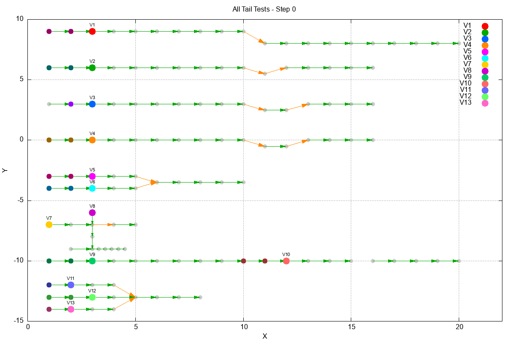

# All Tail Tests Visualization Example

This example combines all tail navigation tests into a single simulation with 8 isolated sub-networks, demonstrating different scenarios for multi-cell vehicles including **merge conflicts**, **crossing trajectories**, **following/rear-end scenarios**, and **triple merges**.



## Road Layout

The simulation contains 8 isolated sub-networks stacked vertically:

### Sub-network 1: L-shaped Road (Cells 1-20)
**Vehicle 1** (tail=2): Successfully passes through

```
[1]-[2]-[3]-[4]-[5]-[6]-[7]-[8]-[9]-[10]
                                      \
                                      [11]-[12]-[13]-[14]-[15]-[16]-[17]-[18]-[19]-[20]
```

- Row 1 (y=9): cells 1-10
- Row 2 (y=8): cells 11-20
- Cell 10 has RIGHT to cell 11

### Sub-network 2: Pingpong Road (Cells 101-116)
**Vehicle 2** (tail=2): Gets stuck at cell 111 (cannot do LEFT while tail completing RIGHT)

```
[101]-[102]-[103]-[104]-[105]-[106]-[107]-[108]-[109]-[110]    [112]-[113]-[114]-[115]-[116]
                                                          \   /
                                                          [111]
```

- Row 1 (y=6): cells 101-110 and 112-116
- Cell 111 (y=5.5): transition cell
- Cell 110 has RIGHT to cell 111
- Cell 111 has LEFT to cell 112

### Sub-network 3: Extended Zigzag (Cells 201-216)
**Vehicle 3** (tail=1): Successfully passes through (tail completes maneuver before next needed)

```
[201]-[202]-[203]-[204]-[205]-[206]-[207]-[208]-[209]-[210]          [213]-[214]-[215]-[216]
                                                          \          /
                                                          [211] - [212]
```

- Row 1 (y=3): cells 201-210 and 213-216
- Cells 211-212 (y=2.5): transition segment
- Cell 210 has RIGHT to cell 211
- Cell 211 has FORWARD to cell 212
- Cell 212 has LEFT to cell 213

### Sub-network 4: Extended Zigzag (Cells 301-316)
**Vehicle 4** (tail=2): Gets stuck at cell 312 (tail[0] still at 310, blocking LEFT maneuver)

```
[301]-[302]-[303]-[304]-[305]-[306]-[307]-[308]-[309]-[310]          [313]-[314]-[315]-[316]
                                                          \          /
                                                          [311] - [312]
```

- Row 1 (y=0): cells 301-310 and 313-316
- Cells 311-312 (y=-0.5): transition segment
- Same structure as sub-network 3

### Sub-network 5: Merge Conflict (Cells 401-415)
**Vehicle 5** (tail=2): Upper path - will conflict with V6 at merge point
**Vehicle 6** (tail=2): Lower path - will conflict with V5 at merge point

```
[401]-[402]-[403]-[404]-[405]
                              \
                              [406]-[407]-[408]-[409]-[410]
                              /
[411]-[412]-[413]-[414]-[415]
```

- Upper path (y=-3): cells 401-405
- Merge point and continuation (y=-3.5): cells 406-410
- Lower path (y=-4): cells 411-415
- Cell 405 has RIGHT to cell 406 (merge via right turn)
- Cell 415 has LEFT to cell 406 (merge via left turn)
- **This demonstrates conflict detection and resolution when two tailed vehicles try to merge!**

### Sub-network 6: Crossing Trajectories (Cells 501-514)
**Vehicle 7** (tail=1): Horizontal path - goes SOUTH through intersection (FORWARD at 504)
**Vehicle 8** (tail=5): Vertical path - enters intersection from above, goes EAST (RIGHT at 504)

```
      [502]
        |
        v
[501]->[503]->[504]->[505]->[506]
                |
                v
              [507]
                |
      [508]-[509]-[510]-[511]-[512]-[513]-[514]
```

- Horizontal start (y=-7): cells 501, 503
- Vertical entry (y=-6): cell 502
- Intersection (y=-7): cell 504 - **BOTH paths cross here!**
- V7 goes FORWARD (south) to 507, then continues east on bottom row
- V8 goes RIGHT (east) to 505, 506
- **This demonstrates crossing trajectory conflict detection!**

### Sub-network 7: Following/Rear-end (Cells 601-620)
**Vehicle 9** (tail=2, speed=3): Fast vehicle that catches up to V10
**Vehicle 10** (tail=2, speed=1): Slow vehicle that stops at dead-end

```
[601]-...-[612]-[613]-[614]-[615]  [616]-...-[620]
                            ^
                         DEAD-END
```

- Extended straight road (y=-10): cells 601-620
- Cell 615 is a DEAD-END (no forward connection)
- V10 starts at cell 612, reaches 615 and STOPS (destination 620 unreachable)
- V9 starts at cell 603 with speed=3, catches up to stopped V10
- V9 STOPS at cell 612 behind V10's tail (at 613)
- **This demonstrates that faster vehicles properly stop behind slower/stopped vehicles' tails!**

### Sub-network 8: Triple Merge (Cells 701-716)
**Vehicle 11** (tail=2): Upper path - merges from above
**Vehicle 12** (tail=2): Middle path - has right of way
**Vehicle 13** (tail=2): Lower path - merges from below

```
[701]-[702]-[703]-[704]
                       \
[705]-[706]-[707]-[708]-[709]-[710]-[711]-[712]
                       /
[713]-[714]-[715]-[716]
```

- Upper path (y=-12): cells 701-704
- Middle path (y=-13): cells 705-712 (main road)
- Lower path (y=-14): cells 713-716
- Cell 704 has RIGHT to cell 709 (merge via right turn)
- Cell 716 has LEFT to cell 709 (merge via left turn)
- **This demonstrates conflict resolution with THREE vehicles trying to merge at the same point!**

## Vehicle Configuration

| Vehicle | Sub-network | Tail Size | Starting Cell | Destination | Expected Result |
|---------|-------------|-----------|---------------|-------------|-----------------|
| V1      | L-shaped    | 2         | 3             | 20          | Passes through  |
| V2      | Pingpong    | 2         | 103           | 116         | Stuck at 111    |
| V3      | Extended    | 1         | 203           | 216         | Passes through  |
| V4      | Extended    | 2         | 303           | 316         | Stuck at 312    |
| V5      | Merge       | 2         | 403           | 410         | Conflict with V6 |
| V6      | Merge       | 2         | 413           | 410         | Conflict with V5 |
| V7      | Crossing    | 1         | 501           | 514         | Cross conflict with V8 |
| V8      | Crossing    | 5         | 502           | 506         | Cross conflict with V7 |
| V9      | Following   | 2         | 603           | 615         | Follows V10, respects tail |
| V10     | Following   | 2         | 612           | 620         | Stops at dead-end 615 |
| V11     | Triple      | 2         | 702           | 712         | Triple merge conflict |
| V12     | Triple      | 2         | 707           | 712         | Triple merge conflict |
| V13     | Triple      | 2         | 714           | 712         | Triple merge conflict |

## Prerequisites

- Rust (cargo)
- gnuplot

## Running

```bash
# Build and run simulation
cargo run --example all-tail

# Generate animated GIF
cd examples/all-tail && gnuplot plot.gnu

# Generate static PNG with all frames
cd examples/all-tail && gnuplot plot_static.gnu
```

## Output Files

- `cells.dat` - Road cell coordinates for gnuplot
- `edges.dat` - Graph edges (connections between cells)
- `vehicle_step_*.dat` - Vehicle position data per step
- `config.gnu` - Auto-generated gnuplot config with step count
- `simulation.gif` - Animated visualization
- `simulation_frames.png` - Static multi-frame visualization

## Visualization Legend

- **Gray points**: Road cells
- **Vehicle 1**: Red head, Dark Magenta tail
- **Vehicle 2**: Green head, Teal tail
- **Vehicle 3**: Blue head, Purple tail
- **Vehicle 4**: Orange head, Brown tail
- **Vehicle 5**: Bright Magenta head, Dark Pink tail
- **Vehicle 6**: Cyan head, Dark Cyan tail
- **Vehicle 7**: Gold head, Dark Gold tail
- **Vehicle 8**: Purple-Pink head, Dark Purple tail
- **Vehicle 9**: Sea Green head, Dark Sea Green tail
- **Vehicle 10**: Salmon head, Dark Red tail
- **Vehicle 11**: Light Blue head, Dark Blue tail
- **Vehicle 12**: Light Green head, Dark Green tail
- **Vehicle 13**: Pink head, Dark Pink tail
- **Green arrows (F)**: Forward movement edges
- **Orange arrows (R/L)**: Right/Left turn edges
- **Labels**: Vehicle IDs displayed above heads
